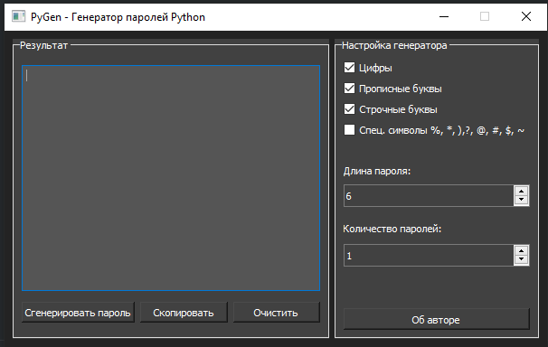

PyGen - password generator
The program is written in python 3 using QtDesigner, using libraries PyQt5, random, 
clipboard. The program generates passwords depending on the generator setup conditions.
Attention, these passwords are not cryptographic))

programm for my portfolio

Pavel Nedoshivin aka basterrus

